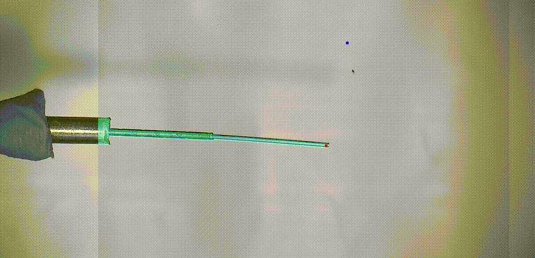

# Tool and retina point tracking for robot visual servoing 
## Intro
This project includes deep learning based image processing procedures that run on input images streamed from an ophthalmic surgical microscope in a phantom setup. 
Algorithms outputs are published in ROS2 for robot control.


<table>
  <tr>
    <td></td>
    <td></td>
  </tr>
</table>


<p align="center">
  
</p>

<p align="center">
  
</p>

## Surgical tool segmentation

### Binary segmentation: Single tool - phantom / external light

Run the following:

```shell
python3 online_TOOL_SEGM_ros.py
```

### Multiclass segmentation: Multiple tools - phantom /  internal light

Run the following:

```shell
python3 online_TOOL_SEGM_mult_ros.py
```


## Retina point tracking

### TAPIR

Run Pytorch TAPIR.

```shell
python3 online_TAPIR_ros.py
```      

Run JAX TAPIR. Inference speed is ~17FPS when the script runs alone and ~10FPS when runs in parallel with segmentation. 

```shell
python3 online_TAPIR_jax_ros.py
```      

### Co-tracker - version 3 

```shell
python3 online_COTRACKER_ros.py
```


## Installation

```shell
conda create --name check_deploymeny_env python=3.11
pip3 install -r requirements.txt

# tapir
git clone https://github.com/deepmind/tapnet.git
cd tapnet
pip install .

# change the 769-771 lines in tapir_model.py (this solves issue with multiple devices, cpu and cuda)
fake_ret = {
   k: torch.zeros(v, dtype=torch.float32, device=torch.device('cuda:0')) for k, v in value_shapes.items()
}

wget -P checkpoints https://storage.googleapis.com/dm-tapnet/causal_tapir_checkpoint.npy
export PYTHONPATH=`(cd ../ && pwd)`:`pwd`:$PYTHONPATH

# SMP library needs to be installed with the following to have access to all models (segformer etc):
pip install --upgrade pip
pip install -U  git+https://github.com/qubvel/segmentation_models.pytorch

```

## Acknowledgments
This folder heavily relies on the following codebases: \
https://github.com/qubvel-org/segmentation_models.pytorch \
https://deepmind-tapir.github.io/ \
https://github.com/facebookresearch/co-tracker \
https://depth-anything.github.io/


